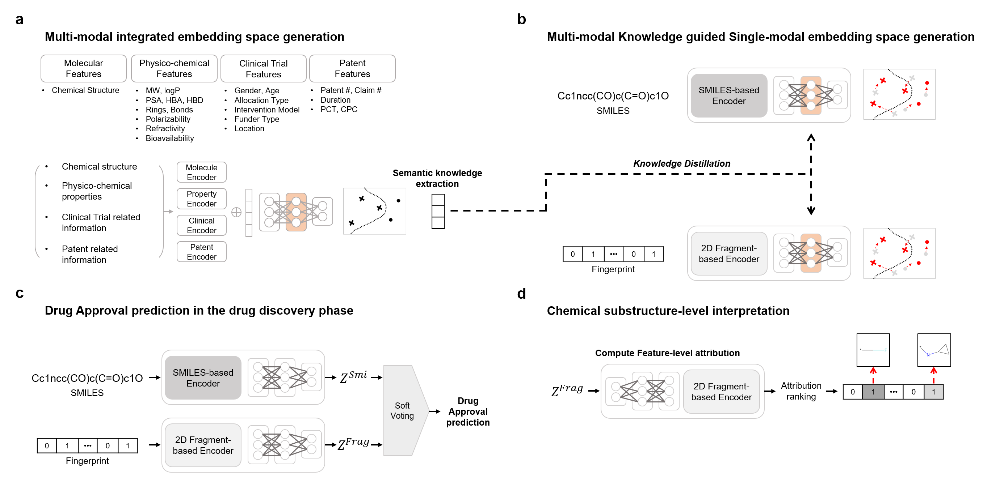
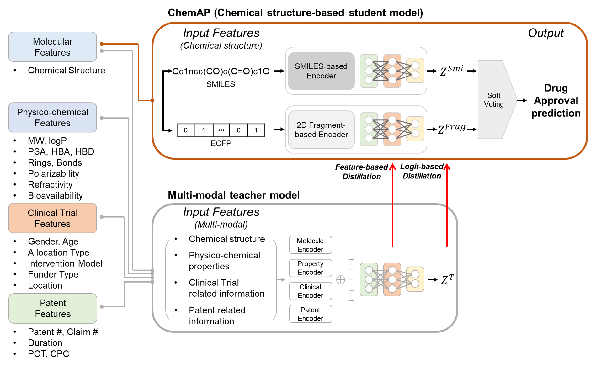

ChemAP (Chemical structure-based Drug Approval Prediction)
=============

Overview of ChemAP

Model architecture of ChemAP

Setup
-------------
First, clone this repository and move to the directory.

    git clone https://github.com/ChangyunCho/ChemAP.git
    cd ChemAP

Prerequisites
-------------
ChemAP training and evaluation were tested for the following python packages and versions.

  - `python`=3.7.11
  - `pytorch`=1.10.0
  - `rdkit`=2022.09.5
  - `numpy`=1.21.2
  - `pandas`=1.3.4
  - `scipy`=1.0.1
  
Example codes
-------------

## Usage for benchmark dataset processing
    python data_processing.py --data_path ./dataset --save_path ./dataset/processed_data --split Drug 
    
## Usage for external dataset processing
    python data_processing.py --data_path ./dataset --save_path ./dataset/processed_data --split Drug  

## Training ChemAP
ChemAP is consist with multi-modal teacher model and two chemical structure-based predictors (student).
Each predictor is trained individually, and the final drug approval prediction is made by soft-voting the drug approval probability of each model.

### 1.Training multi-modal Teacher model
    python Teacher_train.py

### 2.Training SMILES-based predictor
For training SMILES-based predictor, pre-trained ChemBERT [Github link](https://github.com/HyunSeobKim/CHEM-BERT) model is required. 

First, download the pre-trained ChemBERT model using link [here](https://drive.google.com/file/d/1-8oAIwKowGy89w-ZjvCGSc1jsCWNS1Fw/view?usp=sharing).

Second, save the pre-trained model in the following directory './model/ChemBERT/'

Weights for each pre-trained student model in ChemAP can be downloaded through: link [here](https://drive.google.com/drive/folders/1hiHYnaUobdM8LiWDqrW4P0wMPDuK3hUh?usp=sharing).
    
    python SMILES_predictor_train.py 

### 3.Training 2D fragment-based predictor

    python FP_predictor_train.py 
    
### 3.Predict drug approval with ChemAP 
Before predicting drug approval, previous two predictors should be trained.

    python ChemAP.py --data_type DrugApp

## Inference on external dataset
Before performing inference on an external dataset, it should be processed.

    python ChemAP.py --data_type External

## Usage for user provided drug list
    python ChemAP.py --data_type custom --input_file example.csv --output example